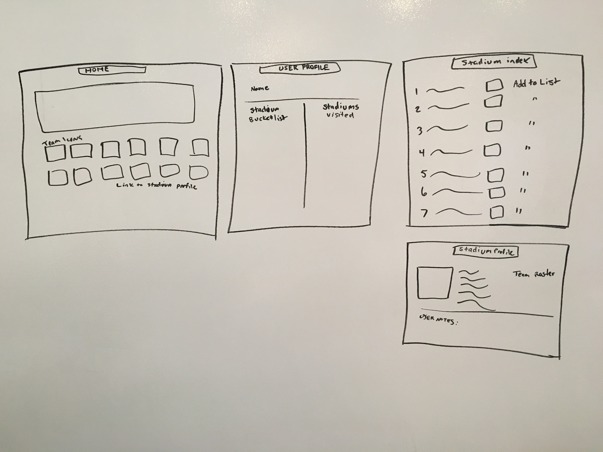
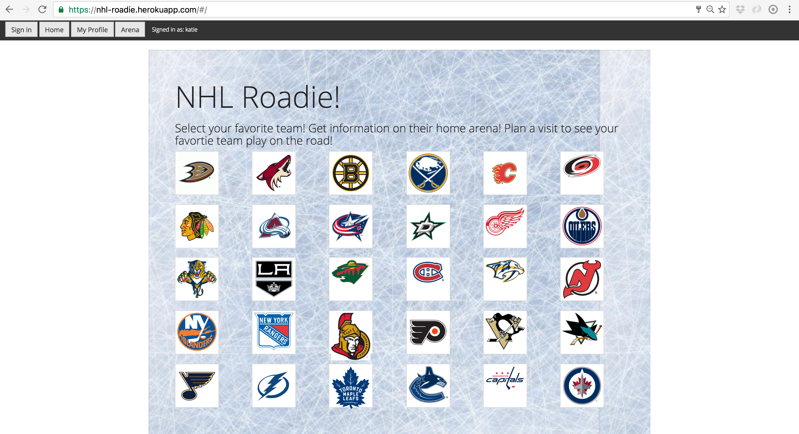
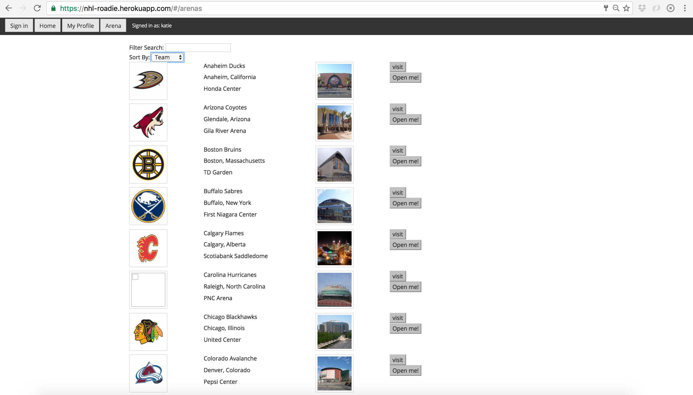
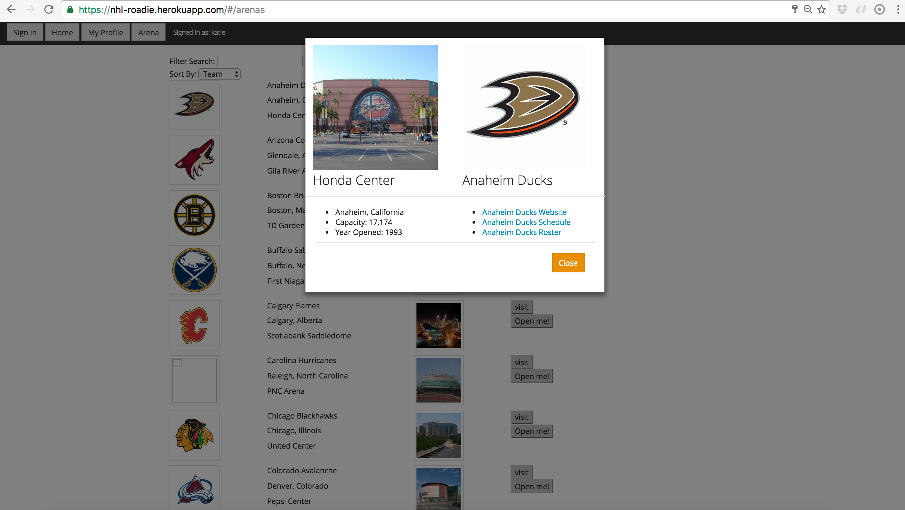

# [NHL-Roadie](https://nhl-roadie.herokuapp.com/)
Created by Katie Ouaknine

## Objective:

NHL Roadies is for the die hard Hockey Fans. An application meant to help the loyal follow their home team battle across the nation, as they compete against teams around the NHL. With NHL Roadie a user can create a log-in, view arenas across the NHL and add those arenas as destinations to ultimate fandom!  
I consider myself a large hockey fan and also a fan of travel. This app was built for like minded fans who want to see their favorite team play away from home.

## Project Requirements:

* Build a full stack application by making a backend and front-end
* Build an API
* Have an interactive front-end
* Present a complete product
* Use a database
* Implement thoughtful user stories
* Have a visually impressive design
* deploy site online

## Technologies Used

* MongoDB
* Express.js
* Angular.js
* Node.js
* JavaScript
* HTML5
* Bootstrap Styling 
* Passport 
* csvjson.com

---

#### Installation Instructions 

 If you wish to install my app and mess around with the components, you will need to: 1) Fork my github repo.
2) Git clone to your local repository/workspace.
3) In the terminal, you will need to navigate to your repo with my project and npm install the NPM packages that I have used (they include bcrypt-nodejs, body-parser, cookie-parser, express, express session, mongoose, morgan, passport, passport-local, and passport-local-mongoose)
4) Create your own dotenv file or link to a local database to store information.

---
#### Approach Taken

I've been a big fan of hockey for a while, but recently I got the idea from some fans of the MLB to plan a visit to see my favorite team play in all the stadiums in the league. I love to travel, I love to eat food, and I love HOCKEY. I wanted to create a site where users could create a bucket list or travelogue of sorts. There really isnt anything like it out there strictly for hockey fans. Last year I was lucky enough to go on a short trip following my favorite team the Anaheim ducks as they played in eastern Canada. I wanted others to be able to plan a trip like it and eventually see all the incredible stadiums and their fans and how each arena experiences the game. 
 
 
I started by creating user stories on [Trello](https://trello.com/b/rKdFuPfW/nhl-roadie) and drawing out some wireframes of basic site navigation

Then, I built out the site, starting with the back end. I followed that by creating Angular elements and implementing Bootstrap and CSS for styling.

---
#### Major Roadblocks
Using "MEAN" stack presents its fair share of complications. It was exciting to see how everything came together. My code wasnt as clean or as organized as I originally had it laid out in my head and certain processes that were seemingly straight forward were far more complicated. My first approach included the idea of using media-wiki API to gather information about the various arenas and that presented a huge road block, one I created a work-around for. 

---

### Future Plans
* Ability for users to define arenas they have already visited and arenas they want to visit
* have the visit arena button toggle depending on user click i.e. visit-visted-like to visit. 
* have a comment section or photo upload so users can document visits to certain stadiums or leave feedback for other users
* have a Yelp API incorporated to guide users to popular food venues in and around the stadium
* add more style and personalization to the users profile and site in general 

---

